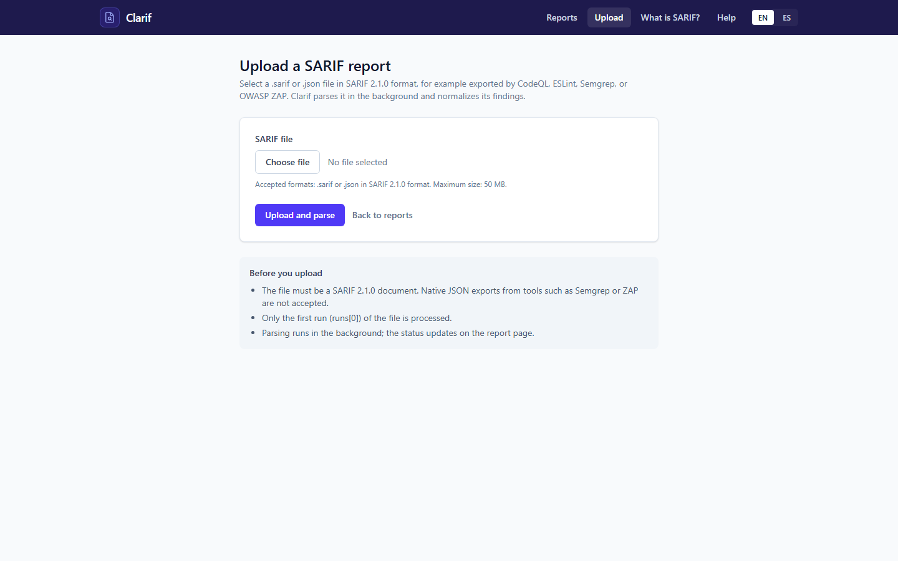
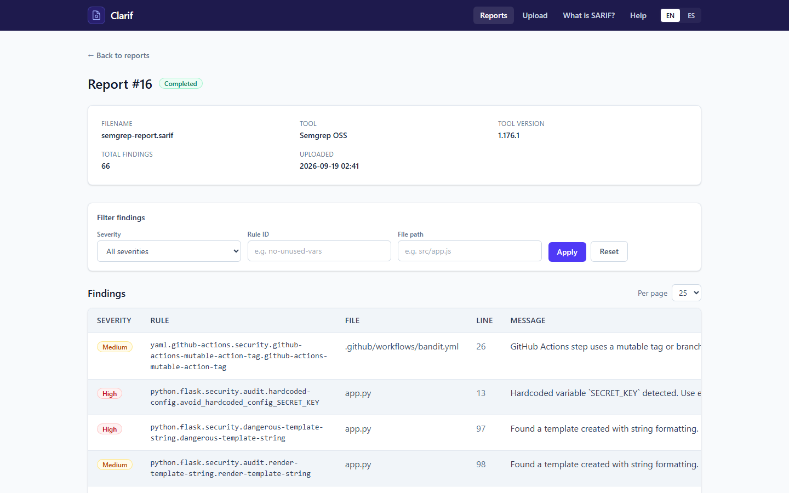
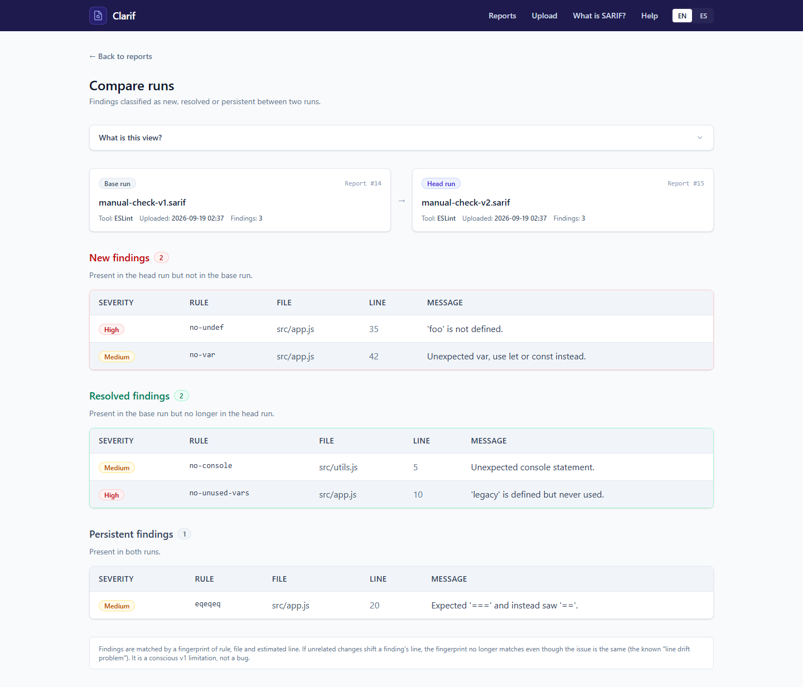

# Clarif

**Read this in English: [README.md](README.md)**

Clarif ingiere reportes crudos [SARIF](https://docs.oasis-open.org/sarif/sarif/v2.1.0/sarif-v2.1.0.html)
(CodeQL, ESLint, Semgrep), normaliza cada hallazgo en un modelo único, los guarda, y compara dos
ejecuciones para mostrar qué es **nuevo**, qué se **resolvió** y qué **persiste**.

Es una herramienta de un solo usuario (sin autenticación), construida con Laravel 13 y PostgreSQL.

## Estado

La subida y el parsing de reportes SARIF a un modelo normalizado y consultable está implementado,
junto con la UI de consulta y los filtros de hallazgos por reporte. La comparación de dos ejecuciones
(hallazgos nuevos, resueltos y persistentes) también está implementada. Hay una distribución con
Docker que levanta todo (app, PostgreSQL y worker de cola) con un solo comando.

## Capturas de pantalla

| Subir un reporte SARIF | Hallazgos con filtros | Comparar dos ejecuciones |
| --- | --- | --- |
|  |  |  |

## Requisitos

- PHP 8.4+ (requerido por las dependencias Symfony 8.x fijadas en el lock) con las extensiones
  `pdo_pgsql` y `pgsql` habilitadas.
- [Composer](https://getcomposer.org/).
- Node.js 20+ y npm.
- [Docker](https://www.docker.com/) con Compose para levantar todo el stack o solo la instancia de
  PostgreSQL de desarrollo.

## Primeros pasos (Docker, recomendado)

Con Docker corriendo, un solo comando construye las imágenes y arranca la aplicación, PostgreSQL y el
worker de cola:

```sh
docker compose up --build
```

Después abrí [http://localhost:8000](http://localhost:8000) y subí un archivo SARIF. No hace falta
configurar nada a mano: los contenedores esperan a PostgreSQL, corren las migraciones y el worker
procesa las subidas en segundo plano.

- La configuración vive en el archivo committeado [`.env.docker`](.env.docker). Contiene **valores
  de demo/local** (incluyendo un `APP_KEY` no secreto y credenciales de base de datos) y no debe
  reutilizarse en un despliegue de producción real.
- `APP_DEBUG=false` está puesto a propósito, así las páginas de error nunca filtran trazas.
- Los datos se guardan en volúmenes nombrados: `postgres-data` (base de datos), `app-storage`
  (archivos SARIF subidos, compartidos por la app y el worker) y `app-logs` (logs de la aplicación y
  del canal `sarif`). Detener el stack con `docker compose down` los conserva; `docker compose up`
  vuelve a levantar todo.
- Para borrar todos los datos, corré `docker compose down -v`.

## Primeros pasos (local)

```sh
# 1. Dependencias de PHP
composer install

# 2. Archivo de entorno
cp .env.example .env
php artisan key:generate
```

Apuntá la configuración de base de datos en `.env` al contenedor de desarrollo (ver
[Base de datos de desarrollo](#base-de-datos-de-desarrollo-docker)):

```dotenv
DB_CONNECTION=pgsql
DB_HOST=127.0.0.1
DB_PORT=5434
DB_DATABASE=clarif
DB_USERNAME=clarif
DB_PASSWORD=secret

QUEUE_CONNECTION=database
```

Luego corré las migraciones y compilá los assets del frontend:

```sh
php artisan migrate

npm install
npm run build
```

Levantá la app, Vite y el worker de cola juntos:

```sh
composer dev
```

## Base de datos de desarrollo (contenedor único)

Para desarrollo local contra el código fuente (sin el stack Docker completo), la instancia de
PostgreSQL corre como un único contenedor Docker. Si usás `docker compose up --build` esto no hace
falta: el servicio `postgres` del archivo compose provee la base de datos.

La primera vez (cuando el contenedor no existe todavía), créalo:

```sh
docker run -d --name clarif-postgres \
  -e POSTGRES_DB=clarif \
  -e POSTGRES_USER=clarif \
  -e POSTGRES_PASSWORD=secret \
  -p 5434:5432 \
  -v clarif-postgres-data:/var/lib/postgresql/data \
  --restart unless-stopped \
  postgres:16-alpine
```

En las siguientes veces el contenedor ya existe, así que solo hay que arrancarlo (no uses de nuevo
`docker run --name clarif-postgres`, fallaría con `container name already in use`):

```sh
docker start clarif-postgres
```

Notas:

- El contenedor se expone en el puerto host **5434** (no en el 5432 por defecto) para no chocar con
  un servicio de PostgreSQL instalado localmente.
- Los datos se guardan en el volumen nombrado `clarif-postgres-data`, así que detener o eliminar el
  contenedor no los borra; arrancarlo de nuevo reutiliza la misma data.
- Gracias a `--restart unless-stopped`, el contenedor se inicia automáticamente cuando arranca
  Docker Desktop, por lo que normalmente no necesitas arrancarlo a mano. Usa
  `docker stop clarif-postgres` / `docker start clarif-postgres` solo después de detenerlo tú.

## Colas

Los jobs en background usan el driver de cola `database` (sin Redis). Las tablas `jobs`,
`job_batches` y `failed_jobs` vienen con las migraciones por defecto, y `QUEUE_CONNECTION=database`
está seteado en `.env`. Para procesar jobs:

```sh
php artisan queue:work
```

## Comandos frecuentes

| Comando | Descripción |
| --- | --- |
| `docker compose up --build` | Construye y arranca la app, PostgreSQL y el worker de cola. |
| `docker compose down` | Detiene el stack (conserva los volúmenes de datos). |
| `docker compose down -v` | Detiene el stack y borra los volúmenes de datos. |
| `composer install` | Instala las dependencias de PHP. |
| `composer dev` | Levanta app, Vite, worker de cola y logs juntos. |
| `composer test` | Limpia config y corre la suite de PHPUnit. |
| `npm run dev` | Levanta Vite en modo watch. |
| `npm run build` | Compila los assets de Tailwind/Vite. |
| `php artisan migrate` | Corre las migraciones pendientes. |
| `php artisan migrate:fresh` | Borra todas las tablas y vuelve a migrar. |
| `php artisan queue:work` | Procesa los jobs de la cola. |
| `php artisan test` | Corre la suite de tests (PHPUnit). |
| `vendor/bin/phpunit` | Corre PHPUnit directamente. |

## Decisiones técnicas

- **Solo SARIF.** Es el único formato de entrada soportado.
- **Parsing en streaming.** Los reportes se leen con
  [`halaxa/json-machine`](https://github.com/halaxa/json-machine) usando generators, nunca un
  `json_decode` completo, y los hallazgos se insertan en lotes de alrededor de 500 filas.
- **PostgreSQL con JSONB.** El hallazgo SARIF crudo se guarda tal cual en una columna `payload`
  JSONB; `codeFlows` no se normaliza a tablas relacionales.
- **Cola en base de datos.** Driver `database` en lugar de Redis.
- **Etiquetas de severidad.** El `level` de SARIF se normaliza a un enum propio y se muestra con una
  etiqueta más clara, orientada a negocio (Alto/Medio/Bajo/Info), con fallback a `warning` cuando no
  hay nada declarado.
- **Patrón repositorio.** Controladores y servicios dependen de contratos de repositorio
  (`app/Contracts`) implementados por repositorios Eloquent (`app/Repositories`); toda la
  generación de consultas vive ahí y los jobs de cola quedan finos. Ver
  [docs/architecture.es.md](docs/architecture.es.md) para las capas y los diagramas.

## Herramientas soportadas y niveles de severidad

Clarif acepta cualquier documento SARIF 2.1.0 válido, así que no está atado a un productor específico.
Está diseñado y probado con **CodeQL, ESLint, Semgrep y OWASP ZAP**.

SARIF solo define cuatro niveles abstractos. Clarif guarda el valor original (para que siga siendo
rastreable y esté disponible al pasar el cursor) pero muestra una etiqueta más clara:

| Nivel SARIF | Etiqueta de Clarif | Significado |
| --- | --- | --- |
| `error` | Alto | La herramienta marcó un problema definitivo. |
| `warning` | Medio | Un problema potencial que conviene revisar. |
| `note` | Bajo | Una observación informativa. |
| `none` | Info | La herramienta no asignó un nivel. |

La etiqueta se deriva únicamente del nivel SARIF. Los puntajes numéricos más finos, como
`properties.security-severity` de CodeQL, **no** se interpretan en la v1. Ver
[docs/scope.es.md](docs/scope.es.md) para el alcance completo.

## Alcance de v1

Ver [docs/scope.es.md](docs/scope.es.md) para el alcance completo y
[docs/diffing.es.md](docs/diffing.es.md) para los detalles de la comparación. En resumen:

- Solo se procesa `runs[0]` de cada archivo SARIF (un run por archivo).
- `codeFlows` se conserva dentro de `payload` pero no se normaliza.
- El diffing agrupa hallazgos por un fingerprint de `rule_id | file_path | línea`. Si cambios no
  relacionados agregan o quitan líneas por encima de un hallazgo, su línea se desplaza y la huella
  deja de coincidir aunque el problema sea el mismo. Es el conocido **"line drift problem"**;
  herramientas como SonarQube lo resuelven con huellas basadas en el contexto de código que rodea al
  hallazgo, mientras que Clarif decide no abordarlo en v1. Es una limitación consciente, no un bug.

## Licencia

Publicado bajo la [licencia MIT](https://opensource.org/licenses/MIT).
