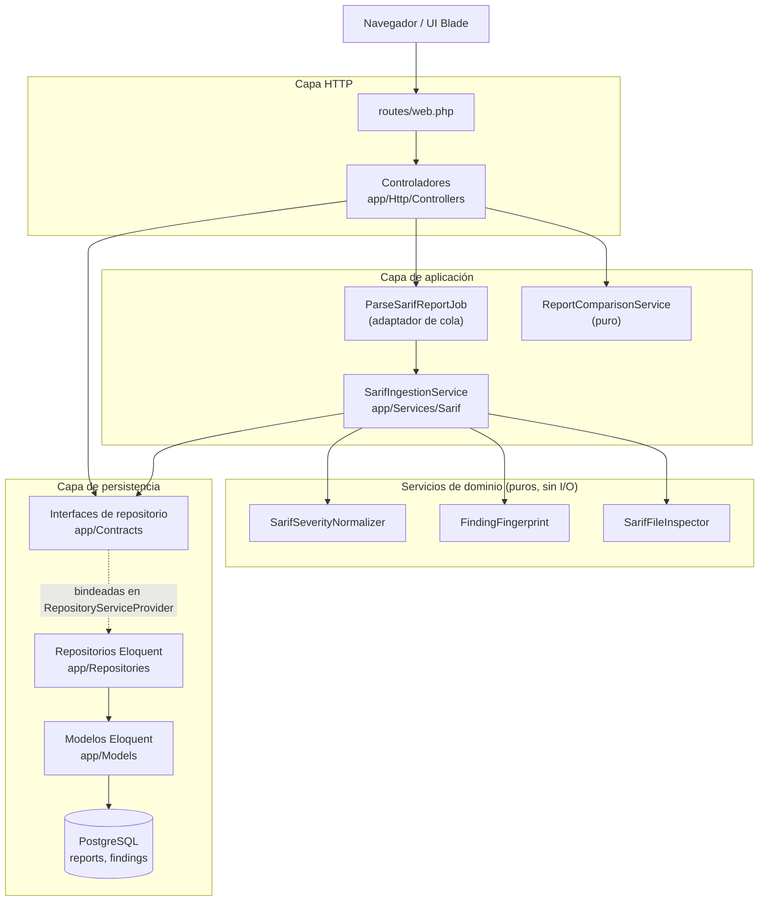
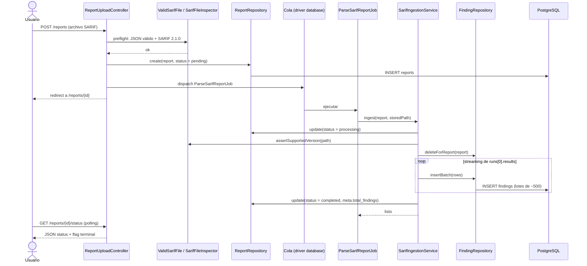
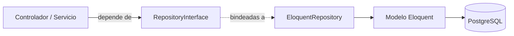
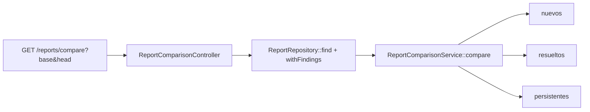
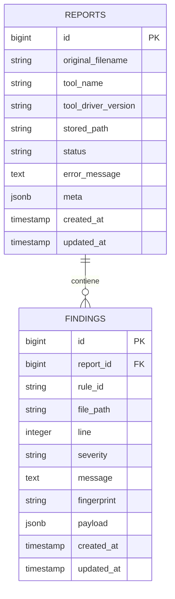

# Arquitectura de Clarif

**Read this in English: [architecture.md](architecture.md)**

Este documento describe cómo está estructurado Clarif, dónde ocurre el acceso a datos y cómo
interactúan las capas. Refleja el código tal como existe hoy.

## Objetivos del diseño

- Mantener las responsabilidades HTTP fuera del cuerpo de los controladores: validan, orquestan y
  renderizan.
- Mantener la lógica de consultas fuera de controladores y servicios: toda la generación de SQL vive
  detrás de contratos de repositorio.
- Mantener la lógica de dominio pura y testeable sin base de datos.
- Mantener la infraestructura de cola fina: los jobs solo adaptan la cola a un servicio.
- Dejar lugar para crecer: agregar un modelo nuevo no debería convertir un controlador en un vertedero
  de acceso a datos.

## Vista por capas



## Responsabilidades por capa

| Capa | Ubicación | Responsabilidad |
| --- | --- | --- |
| HTTP | `app/Http/Controllers`, `routes/web.php` | Validar entrada, resolver fragmentos, renderizar vistas o JSON. Sin consultas. |
| Cola | `app/Jobs` | Adaptar la cola a un servicio. `ParseSarifReportJob` solo llama a `SarifIngestionService`. |
| Aplicación / dominio | `app/Services/Sarif` | Parsing, normalización, huellas y diffing. Sin SQL. |
| Contratos de persistencia | `app/Contracts` | Interfaces de las que depende la aplicación. |
| Implementación de persistencia | `app/Repositories` | Único lugar que emite consultas. Eloquent y el query builder. |
| Entidades | `app/Models` | Modelos Eloquent y sus relaciones/casts. |
| Transversal | `app/Enums`, `app/Exceptions`, `app/Rules` | Estados, severidad, razones de fallo, excepción de parseo, regla de validación de subida. |

## Mapa de directorios

```
app/
├── Contracts/
│   ├── FindingRepositoryInterface.php
│   └── ReportRepositoryInterface.php
├── Enums/
│   ├── ReportFailureReason.php
│   ├── ReportStatus.php
│   └── SarifLevel.php
├── Exceptions/
│   └── SarifParsingException.php
├── Http/
│   ├── Controllers/
│   │   ├── AboutController.php
│   │   ├── HelpController.php
│   │   ├── LocaleController.php
│   │   ├── ReportComparisonController.php
│   │   ├── ReportController.php
│   │   └── ReportUploadController.php
│   └── Middleware/
│       └── SetLocale.php
├── Jobs/
│   └── ParseSarifReportJob.php
├── Models/
│   ├── Finding.php
│   ├── Report.php
│   └── User.php
├── Providers/
│   ├── AppServiceProvider.php
│   └── RepositoryServiceProvider.php
├── Repositories/
│   ├── EloquentFindingRepository.php
│   └── EloquentReportRepository.php
├── Rules/
│   └── ValidSarifFile.php
└── Services/
    └── Sarif/
        ├── FindingFingerprint.php
        ├── ReportComparisonService.php
        ├── SarifFileInspector.php
        ├── SarifIngestionService.php
        └── SarifSeverityNormalizer.php
```

## Flujo de subida y parseo



El archivo se lee dos veces, nunca completo en memoria:

1. Una pasada acotada sobre `runs[0].tool.driver` (nombre, versión y reglas).
2. Una pasada en streaming sobre `runs[0].results` que arma filas y las inserta por lotes.

Solo se procesa `runs[0]`. `codeFlows` se conserva dentro del `payload` de cada hallazgo, nunca se
normaliza.

## Persistencia: contratos y repositorios

Controladores y servicios dependen de interfaces, nunca de Eloquent directamente. El binding vive en
`app/Providers/RepositoryServiceProvider`, registrado en `bootstrap/providers.php`.



`ReportRepositoryInterface`:

| Método | Usado por | SQL generado |
| --- | --- | --- |
| `paginateLatest(int $perPage)` | `ReportController@index` | `SELECT reports` con `WITH COUNT(findings)`, ordenado por id desc, paginado |
| `find(int $id)` | `ReportComparisonController` | `SELECT reports WHERE id = ?` |
| `create(array $attributes)` | `ReportUploadController@store` | `INSERT INTO reports` |
| `update(Report $report, array $attributes)` | `SarifIngestionService` | `UPDATE reports` |
| `delete(Report $report)` | `ReportController@destroy` | `DELETE FROM reports` (cascada a findings) |
| `countUpTo(int $id)` | `ReportController@reportNumber`, `ReportComparisonController@reportNumber` | `SELECT COUNT(*) FROM reports WHERE id <= ?` |
| `withFindings(Report $report)` | `ReportComparisonController` | Eager load de la relación `findings` |

`FindingRepositoryInterface`:

| Método | Usado por | SQL generado |
| --- | --- | --- |
| `paginateForReport(Report, array $filters, int $perPage)` | `ReportController@show` | `SELECT findings WHERE report_id = ?` más `severity = ?`, `rule_id LIKE ?`, `file_path LIKE ?` opcionales, paginado |
| `insertBatch(array $rows)` | `SarifIngestionService` | `INSERT INTO findings` de un lote, dentro de una transacción |
| `deleteForReport(Report $report)` | `SarifIngestionService` | `DELETE FROM findings WHERE report_id = ?` |

El único uso de query builder de bajo nivel en la aplicación es el insert por lotes y el delete en
`EloquentFindingRepository`. Todo lo demás pasa por Eloquent.

## Flujo de comparación



`ReportComparisonService` es puro: trabaja solo sobre las colecciones de `findings` ya cargadas y
clasifica cada hallazgo por identidad de huella (solo en head = nuevo, solo en base = resuelto, en
ambos = persistente). Nunca emite una consulta.

## Modelo de datos



- `reports.status` se castea a `ReportStatus`; `reports.meta` guarda `total_findings` y
  `failure_reason` y se castea a array.
- `findings.severity` se castea a `SarifLevel`; `findings.payload` conserva el resultado SARIF crudo
  y se castea a array.
- `findings` tiene índices en `(report_id, fingerprint)`, `rule_id`, `file_path` y `severity`.

## Inyección de dependencias

- El contenedor resuelve `EloquentReportRepository` y `EloquentFindingRepository` porque están
  bindeados a sus interfaces en `RepositoryServiceProvider`.
- Los controladores reciben los repositorios por inyección de constructor.
- `SarifIngestionService` se inyecta por método en el job (`handle(SarifIngestionService $ingestion)`)
  para que ningún servicio se serialice en el payload de la cola. Sus propias dependencias
  (repositorios y servicios puros) se inyectan por constructor y las resuelve el contenedor.

## Estrategia de tests

| Tipo | Ubicación | Base de datos | Propósito |
| --- | --- | --- | --- |
| Unit (servicios puros) | `tests/Unit/Services` | No | Normalización, huellas, inspección, comparación. |
| Unit (con fakes) | `tests/Unit/Services/SarifIngestionServiceTest.php` | No | Lógica de ingesta contra fakes de repositorio en memoria. |
| Feature | `tests/Feature` | Sí (SQLite `:memory:`) | Subida, job de parseo, UI, comparación, casts de modelos. |

Los fakes viven en `tests/Support` (`FakeReportRepository`, `FakeFindingRepository`) e implementan los
mismos contratos, lo que demuestra que el servicio de ingesta está desacoplado del SQL.

Los tests feature siguen siendo la red de seguridad para la semántica real de las consultas (`LIKE`,
JSONB, paginación). Los fakes de repositorio nunca se usan en tests feature.

Nota (Windows): el nombre del disco fake es único por clase de test (`sarif` para tests feature,
`sarif-ingestion` para el unit test de ingesta). Compartir un disco fake entre clases de test puede
provocar errores de `Permission denied` porque `Storage::fake` limpia el mismo directorio.

## Decisiones de diseño y trade-offs

- Los repositorios devuelven modelos Eloquent y `LengthAwarePaginator`, así que Eloquent queda cerca.
  Es una elección pragmática deliberada frente a DTOs y tipos de colección propios.
- La abstracción es intencionalmente acotada: solo se envuelve la persistencia. Los servicios puros
  ya no tienen I/O y no se esconden detrás de interfaces.
- Cambiar el motor de base de datos (PostgreSQL a MySQL/SQLite) sigue siendo un tema de configuración
  y migraciones, no de repositorios. El límite del repositorio es lo que permitiría cambiar la
  *tecnología* de almacenamiento (por ejemplo, una implementación SQL a mano, un servicio externo o
  DTOs) sin tocar controladores ni servicios.

## Agregar un modelo nuevo

1. Crear el modelo Eloquent y su migración.
2. Agregar `XRepositoryInterface` en `app/Contracts`.
3. Agregar `EloquentXRepository` en `app/Repositories`.
4. Bindear la interfaz a la implementación en `RepositoryServiceProvider`.
5. Inyectar la interfaz donde se necesite.

Los controladores mantienen solo lógica HTTP; la lógica de consultas queda en el repositorio.
