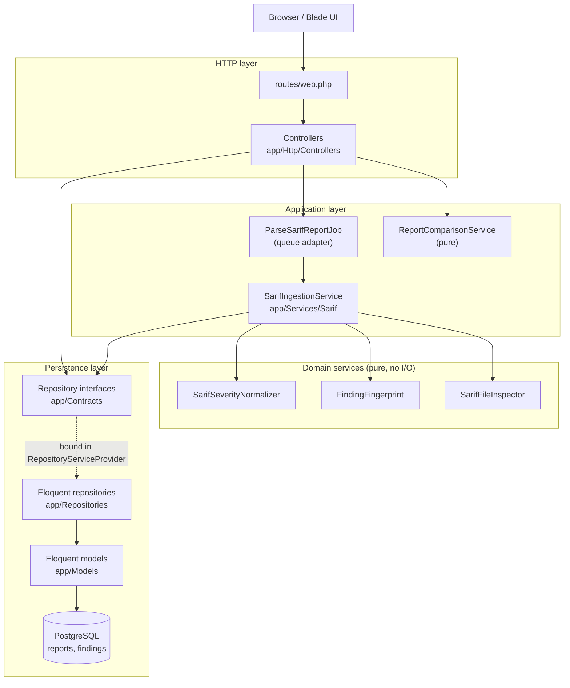
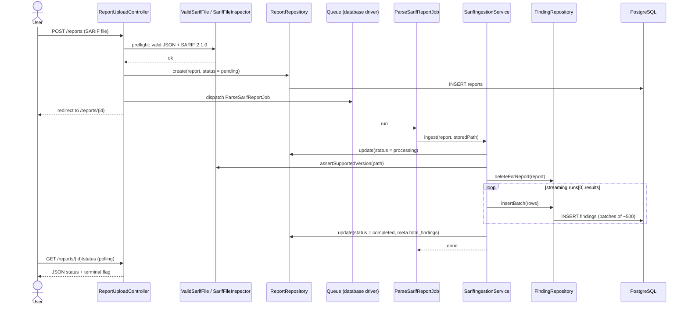
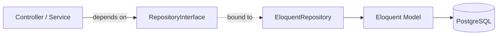
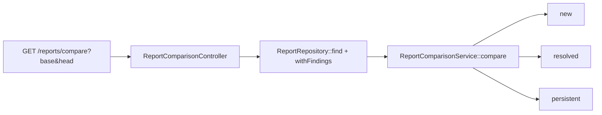
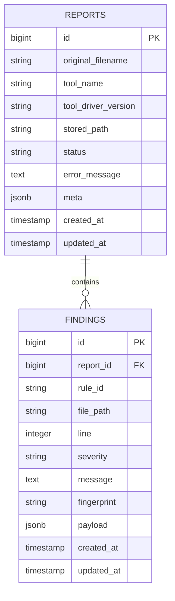

# Clarif architecture

**Leer en español: [architecture.es.md](architecture.es.md)**

This document describes how Clarif is structured, where data access happens, and how the layers
interact. It reflects the code as it exists today.

## Goals of the design

- Keep HTTP concerns out of controllers' bodies: controllers validate, orchestrate and render.
- Keep query logic out of controllers and services: all SQL generation lives behind repository
  contracts.
- Keep domain logic pure and unit testable without a database.
- Keep the queue infrastructure thin: jobs only adapt the queue to a service.
- Make room to grow: adding a new model should not turn a controller into a data-access dumping
  ground.

## Layered view



## Layer responsibilities

| Layer | Location | Responsibility |
| --- | --- | --- |
| HTTP | `app/Http/Controllers`, `routes/web.php` | Validate input, resolve fragments, render views or JSON. No queries. |
| Queue | `app/Jobs` | Adapt the queue to a service. `ParseSarifReportJob` only calls `SarifIngestionService`. |
| Application / domain | `app/Services/Sarif` | Parsing, normalization, fingerprinting and diffing. No SQL. |
| Persistence contracts | `app/Contracts` | Interfaces the application depends on. |
| Persistence implementation | `app/Repositories` | The only place that issues queries. Eloquent and the query builder. |
| Entities | `app/Models` | Eloquent models and their relations/casts. |
| Cross-cutting | `app/Enums`, `app/Exceptions`, `app/Rules` | Statuses, severity, failure reasons, parsing exception, upload validation rule. |

## Directory map

```
app/
├── Contracts/
│   ├── FindingRepositoryInterface.php
│   └── ReportRepositoryInterface.php
├── Enums/
│   ├── ReportFailureReason.php
│   ├── ReportStatus.php
│   └── SarifLevel.php
├── Exceptions/
│   └── SarifParsingException.php
├── Http/
│   ├── Controllers/
│   │   ├── AboutController.php
│   │   ├── HelpController.php
│   │   ├── LocaleController.php
│   │   ├── ReportComparisonController.php
│   │   ├── ReportController.php
│   │   └── ReportUploadController.php
│   └── Middleware/
│       └── SetLocale.php
├── Jobs/
│   └── ParseSarifReportJob.php
├── Models/
│   ├── Finding.php
│   ├── Report.php
│   └── User.php
├── Providers/
│   ├── AppServiceProvider.php
│   └── RepositoryServiceProvider.php
├── Repositories/
│   ├── EloquentFindingRepository.php
│   └── EloquentReportRepository.php
├── Rules/
│   └── ValidSarifFile.php
└── Services/
    └── Sarif/
        ├── FindingFingerprint.php
        ├── ReportComparisonService.php
        ├── SarifFileInspector.php
        ├── SarifIngestionService.php
        └── SarifSeverityNormalizer.php
```

## Upload and parsing flow



The file is read twice, never fully in memory:

1. A bounded pass over `runs[0].tool.driver` (name, version and rules).
2. A streaming pass over `runs[0].results` that builds rows and inserts them in batches.

Only `runs[0]` is processed. `codeFlows` is preserved inside each finding `payload`, never
normalized.

## Persistence: contracts and repositories

Controllers and services depend on interfaces, never on Eloquent directly. The binding lives in
`app/Providers/RepositoryServiceProvider`, registered in `bootstrap/providers.php`.



`ReportRepositoryInterface`:

| Method | Used by | SQL produced |
| --- | --- | --- |
| `paginateLatest(int $perPage)` | `ReportController@index` | `SELECT reports` with `WITH COUNT(findings)`, ordered by id desc, paginated |
| `find(int $id)` | `ReportComparisonController` | `SELECT reports WHERE id = ?` |
| `create(array $attributes)` | `ReportUploadController@store` | `INSERT INTO reports` |
| `update(Report $report, array $attributes)` | `SarifIngestionService` | `UPDATE reports` |
| `delete(Report $report)` | `ReportController@destroy` | `DELETE FROM reports` (cascades to findings) |
| `countUpTo(int $id)` | `ReportController@reportNumber`, `ReportComparisonController@reportNumber` | `SELECT COUNT(*) FROM reports WHERE id <= ?` |
| `withFindings(Report $report)` | `ReportComparisonController` | Eager loads the `findings` relation |

`FindingRepositoryInterface`:

| Method | Used by | SQL produced |
| --- | --- | --- |
| `paginateForReport(Report, array $filters, int $perPage)` | `ReportController@show` | `SELECT findings WHERE report_id = ?` plus optional `severity = ?`, `rule_id LIKE ?`, `file_path LIKE ?`, paginated |
| `insertBatch(array $rows)` | `SarifIngestionService` | `INSERT INTO findings` for a batch, inside a transaction |
| `deleteForReport(Report $report)` | `SarifIngestionService` | `DELETE FROM findings WHERE report_id = ?` |

The only low-level query-builder usage in the application is the batch insert and delete in
`EloquentFindingRepository`. Everything else goes through Eloquent.

## Comparison flow



`ReportComparisonService` is pure: it works only on the already loaded `findings` collections and
classifies each finding by fingerprint identity (present in head only = new, in base only =
resolved, in both = persistent). It never issues a query.

## Data model



- `reports.status` is cast to `ReportStatus`; `reports.meta` holds `total_findings` and
  `failure_reason` and is cast to array.
- `findings.severity` is cast to `SarifLevel`; `findings.payload` keeps the raw SARIF result and is
  cast to array.
- `findings` is indexed on `(report_id, fingerprint)`, `rule_id`, `file_path` and `severity`.

## Dependency injection

- The container resolves `EloquentReportRepository` and `EloquentFindingRepository` because they are
  bound to their interfaces in `RepositoryServiceProvider`.
- Controllers receive repositories through constructor injection.
- `SarifIngestionService` is method-injected into the job (`handle(SarifIngestionService $ingestion)`)
  so no service is serialized into the queue payload. Its own dependencies (repositories and pure
  services) are constructor-injected and resolved by the container.

## Testing strategy

| Kind | Location | Database | Purpose |
| --- | --- | --- | --- |
| Unit (pure services) | `tests/Unit/Services` | No | Normalization, fingerprinting, inspection, comparison. |
| Unit (with fakes) | `tests/Unit/Services/SarifIngestionServiceTest.php` | No | Ingestion logic against in-memory repository fakes. |
| Feature | `tests/Feature` | Yes (SQLite `:memory:`) | Upload, parsing job, UI, comparison, model casts. |

The fakes live in `tests/Support` (`FakeReportRepository`, `FakeFindingRepository`) and implement the
same contracts, which proves the ingestion service is decoupled from SQL.

Feature tests remain the safety net for real query semantics (`LIKE`, JSONB, pagination). Repository
fakes are never used in feature tests.

Note (Windows): the fake disk name is unique per test class (`sarif` for feature tests,
`sarif-ingestion` for the ingestion unit test). Sharing a fake disk between test classes can cause
`Permission denied` errors from `Storage::fake` cleaning the same directory.

## Design decisions and trade-offs

- Repositories return Eloquent models and `LengthAwarePaginator`, so Eloquent stays close. This is a
  deliberate pragmatic choice over DTOs and custom collection types.
- The abstraction is intentionally narrow: only persistence is wrapped. Pure services already have
  no I/O and are not hidden behind interfaces.
- Swapping the database engine (PostgreSQL to MySQL/SQLite) is still a config and migration concern,
  not a repository concern. The repository boundary is what would let the storage *technology*
  change (for example, a hand-written SQL implementation, an external service, or DTOs) without
  touching controllers or services.

## Adding a new model

1. Create the Eloquent model and its migration.
2. Add `XRepositoryInterface` in `app/Contracts`.
3. Add `EloquentXRepository` in `app/Repositories`.
4. Bind the interface to the implementation in `RepositoryServiceProvider`.
5. Inject the interface where it is needed.

Controllers keep only HTTP logic; query logic stays in the repository.
